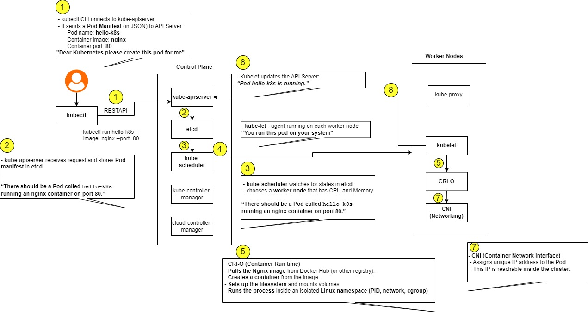

# Kubernetes Hands-On Exercise Series

Welcome to Exercise-1 **Kubernetes (K8s) exercises**!  
These activities will help you understand the basics of how Kubernetes runs and manages containerized applications.  

## Business Problem (Zepto Example)

Imagine you are a **DevOps Engineer at Zepto** 
The product team just built a lightweight **web app** that shows the **storefront and delivery status page** for customers.  

Your task as the DevOps engineer:  
**Deploy this app on Kubernetes** so that it is always running, portable, and can be scaled later.
Simulate this  using the popular `nginx` container image (think of it as Zepto’s storefront web app).

## Exercise 1: Hello Pod

**Goal:** Run your first app inside Kubernetes and access it.

## Pre-Requisites
1. **Install Minikube (one-time setup)**
   - On Linux:
     ```bash
     curl -LO https://storage.googleapis.com/minikube/releases/latest/minikube-linux-amd64
     sudo install minikube-linux-amd64 /usr/local/bin/minikube
     ```
   - On macOS (with Homebrew):
     ```bash
     brew install minikube
     ```
   - On Windows (PowerShell, run as Administrator):
     ```powershell
     choco install minikube
     ```
   > You need **Docker** or a VM driver (VirtualBox, Hyper-V) installed.

### Steps: Deploy Ngnix Image as a Pod
1. Start a local Kubernetes cluster with **Minikube**:
   ```bash
   minikube start
   
2. Create your first Pod (using Nginx image):
   ```bash
   kubectl run hello-k8s --image=nginx --port=80

3. Verify the Pod is running:
   ```bash
   kubectl get pods

4. Expose the Pod as a Service:
   ```bash
   kubectl expose pod hello-k8s --type=NodePort --port=80

5. Open the app in your browser:
   ```bash
   minikube service hello-k8s

You should see the Nginx welcome page. 
Congratulations, you just deployed your first container in Kubernetes!

## System Internal Details
<p align="center">
  
</p>

## 


