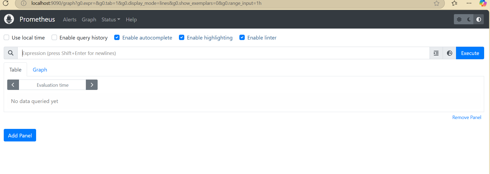
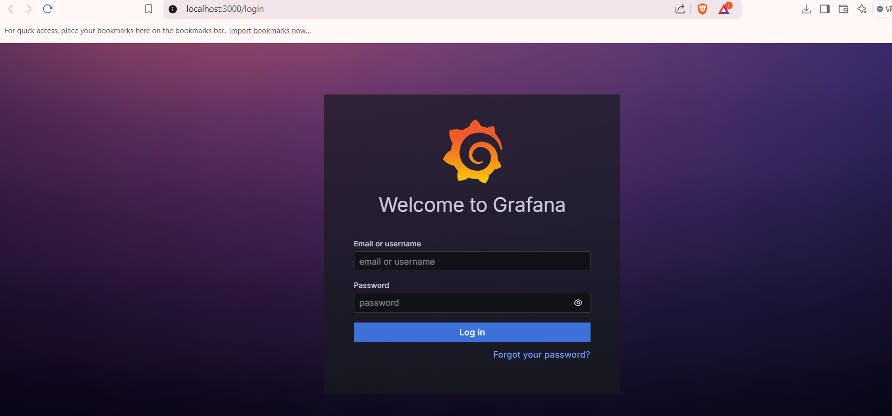
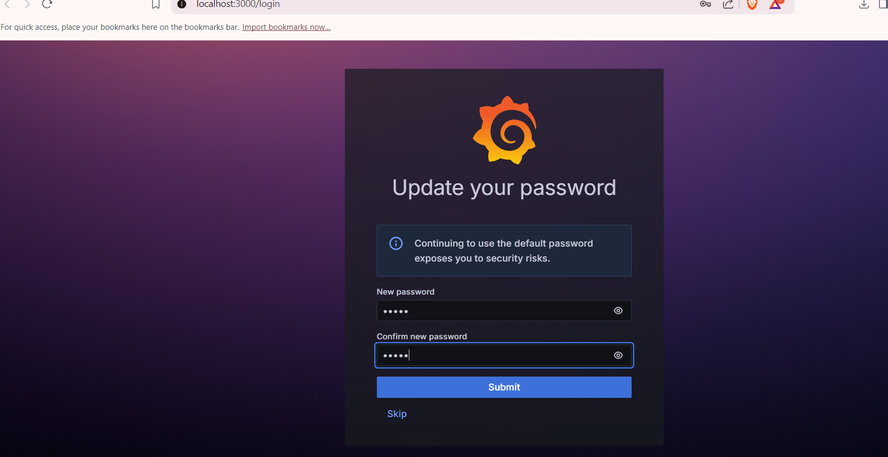
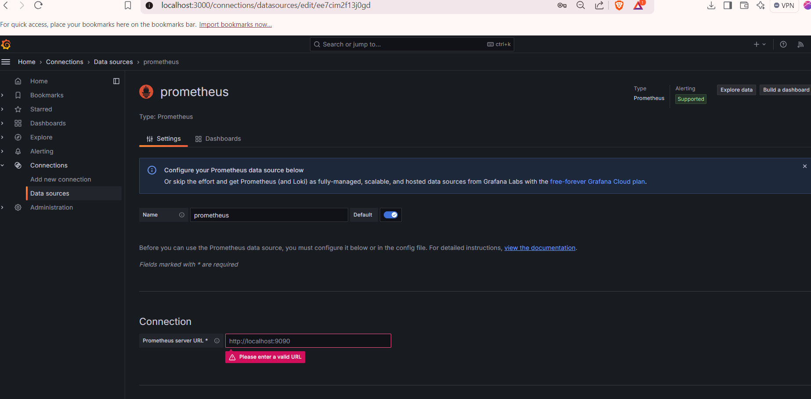
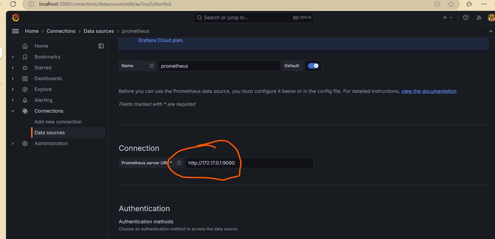
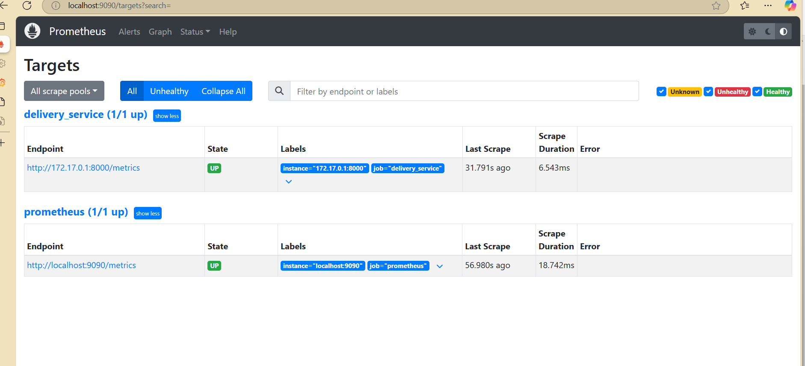
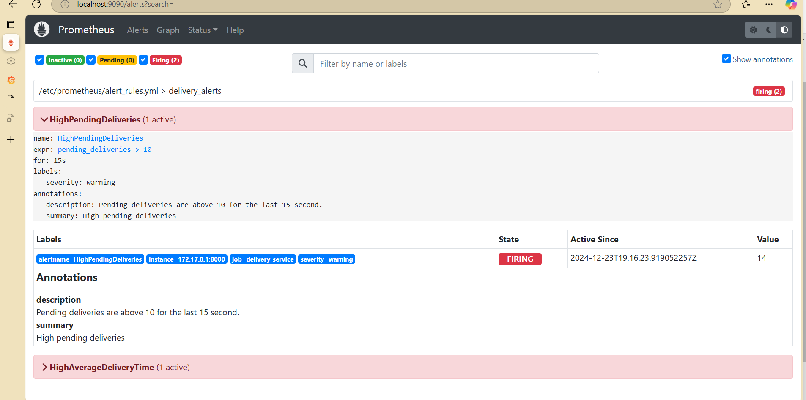
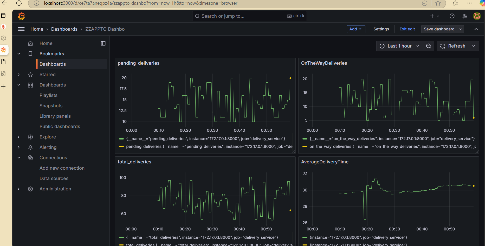

# Real-Time Delivery Monitoring Pipeline

## **Objective**
You are a DevOps engineer in ZAPPTTO managing a fast-paced delivery service that needs real-time insights into operational efficiency and delivery performance.
You task is to create monitoring application top provide insights on performance of the delivery service.

## **Approach**
Using Python, Prometheus, Grafana and Jenkins, create a pipeline that simulates delivery metrics, visualizes them on dashboards and sets up automated alerts to ensure smooth operations and quick problem detection.

---

## **1. Prerequisites**
Ensure the following tools are installed:
- **Docker**: For containerizing and running services.
- **Python**: Version 3.10 or higher.
- **Jenkins**: For pipeline automation.
- **Prometheus**: For metrics scraping.
- **Grafana**: For data visualization.

---

## **2a. Install Packages**

```
pip3 install prometheus-client
```

## **2. Code Directory Structure**

```
delivery_monitoring/
├── delivery_metrics.py   # Python script to simulate metrics
├── prometheus.yml        # Prometheus configuration
├── alerts_rules.yml      # Alerts configuration
├── Jenkinsfile           # Jenkins pipeline script

Steps:
mkdir delivery_monitoring
cd delivery_monitoring
```
Create above files under 'delivery_monitoring' directory

---

## **3. Steps to Set Up and Simulate**

### **Step 1: Write the Python Application**
Create a file named `delivery_metrics.py`:

```
from prometheus_client import start_http_server, Summary, Gauge
import random
import time

# Metrics
total_deliveries = Gauge("total_deliveries", "Total number of deliveries")
pending_deliveries = Gauge("pending_deliveries", "Number of pending deliveries")
on_the_way_deliveries = Gauge("on_the_way_deliveries", "Number of deliveries on the way")
average_delivery_time = Summary("average_delivery_time", "Average delivery time in seconds")

# Simulate delivery statuses
def simulate_delivery():
    #pending = random.randint(10, 50)
    pending = random.randint(10, 20)  # Ensure values exceed the threshold
    on_the_way = random.randint(5, 20)
    delivered = random.randint(30, 70)
    avg_time = random.uniform(15, 45)

    total = pending + on_the_way + delivered

    print(f"[DEBUG] Total deliveries: {total}")
    print(f"[DEBUG] Pending deliveries: {pending}")
    print(f"[DEBUG] On-the-way deliveries: {on_the_way}")
    print(f"[DEBUG] Average delivery time: {avg_time:.2f} seconds")

    total_deliveries.set(total)
    pending_deliveries.set(pending)
    on_the_way_deliveries.set(on_the_way)
    average_delivery_time.observe(avg_time)

if __name__ == "__main__":
    print("[INFO] Starting the HTTP server on port 8000...")
    start_http_server(8000, addr="0.0.0.0")
    print("[INFO] HTTP server started. Simulating deliveries...")
    while True:
        simulate_delivery()
        print("[INFO] Sleeping for 1 seconds...")
        time.sleep(1)
```

Run the script:
```
python3 delivery_metrics.py

[INFO] Sleeping for 1 seconds...
[DEBUG] Total deliveries: 69
[DEBUG] Pending deliveries: 20
[DEBUG] On-the-way deliveries: 17
[DEBUG] Average delivery time: 28.26 seconds
[INFO] Sleeping for 1 seconds...
[DEBUG] Total deliveries: 96
[DEBUG] Pending deliveries: 13
[DEBUG] On-the-way deliveries: 16
[DEBUG] Average delivery time: 41.62 sec
```

Access metrics at [http://localhost:8000/metrics](http://localhost:8000/metrics).

```
curl http://localhost:8000/metrics
# HELP python_gc_objects_collected_total Objects collected during gc
# TYPE python_gc_objects_collected_total counter
python_gc_objects_collected_total{generation="0"} 242.0
python_gc_objects_collected_total{generation="1"} 18.0
python_gc_objects_collected_total{generation="2"} 0.0
# HELP python_gc_objects_uncollectable_total Uncollectable objects found during GC
# TYPE python_gc_objects_uncollectable_total counter
python_gc_objects_uncollectable_total{generation="0"} 0.0
python_gc_objects_uncollectable_total{generation="1"} 0.0
python_gc_objects_uncollectable_total{generation="2"} 0.0
# HELP python_gc_collections_total Number of times this generation was collected
# TYPE python_gc_collections_total counter
python_gc_collections_total{generation="0"} 33.0
python_gc_collections_total{generation="1"} 2.0
python_gc_collections_total{generation="2"} 0.0
# HELP python_info Python platform information
# TYPE python_info gauge
python_info{implementation="CPython",major="3",minor="12",patchlevel="3",version="3.12.3"} 1.0
# HELP process_virtual_memory_bytes Virtual memory size in bytes.
# TYPE process_virtual_memory_bytes gauge
process_virtual_memory_bytes 1.81510144e+08
# HELP process_resident_memory_bytes Resident memory size in bytes.
# TYPE process_resident_memory_bytes gauge
process_resident_memory_bytes 2.3887872e+07
```

---

**Note about /metrics:**
1. The endpoint **/metrics** is automatically created by the prometheus_client library when we start the HTTP server with start_http_server.
2. **start_http_server** function in the prometheus_client library starts a simple HTTP server which by default listens on Port **8000**
3. Each metric is defined by:
     -  A name (e.g. total_deliveries).
     -  A description (e.g. "Total number of deliveries").
     -  A type (e.g., Gauge, Counter, Summary, etc.)
     -  For example: total_deliveries = Gauge("total_deliveries", "Total number of deliveries") - defines metric called "total_deliveries" with description "Total number of deliveries" and type "Gauage"
4. Type of Metrics:
     -  **Counter** for counting.
     -  **Gauge** for values that increase or decrease.
     -  **Histogram** for bar distributions with a fixed number of buckets.
     -  **Summary** for quantiles (e.g. percentiles)
5. When we hit http://localhost:8000/metrics in a browser or use a tool like curl, the server responds with the current state of the metrics that is defined (total_deliveries, pending_deliveries, etc.).

---

### **Step 2a: Configure Prometheus**

Create a file named **prometheus.ym**

```
scrape_configs:
  - job_name: "prometheus"
    static_configs:
      - targets: ["localhost:9090"]

  - job_name: "delivery_service"
    static_configs:
      - targets: ["172.17.0.1:8000"]

rule_files:
  - /etc/prometheus/alert_rules.yml 
```

### **Step 2a: Configure alerts**

Create a file named **alert_rules.yml**
```
groups:
  - name: delivery_alerts
    rules:
      - alert: HighPendingDeliveries
        expr: pending_deliveries > 10
        for: 15s
        labels:
          severity: warning
        annotations:
          summary: "High pending deliveries"
          description: "Pending deliveries are above 10 for the last 15 second."

      - alert: HighAverageDeliveryTime
        expr:  (average_delivery_time_sum / average_delivery_time_count) > 30
        labels:
          severity: critical
        annotations:
          summary: "High average delivery time"
          description: "Average delivery time is above 30 seconds for the last 15 seconds."
```
---
**Note about prometheus.yml file:**
1. **scrape_configs** is top-level configuration key to define scrapping (i.e. read metrics) jobs
2. **job_name** defines a specific scapping job
3. **targets** specifies the host name (endpoints) from where prometheus will scrape (i.e. read) metrics
4. **host.docker.internal** this specifies the target hostname.
   - This hostname allows a Docker container (e.g., Prometheus) to access services running on the host machine.
   - On **Linux or WSL** use the host IP address (e.g. 172.17.0.1)
   - On **MacOS and Windows native** this resolves to the host machine IP address
5. Prometheus will send HTTP GET requests to http://host.docker.internal:8000/metrics periodically at **default interval (15s)** to retrieve metrics.
   
Run Prometheus:
```
docker run -d --name prometheus --network=host -v ./prometheus.yml:/etc/prometheus/prometheus.yml -v ./alert_rules.yml:/etc/prometheus/alert_rules.yml  prom/prometheus
```

Output
```
docker run -d --name=prometheus --network=host prom/prometheus
44cfd54b489e8f813ad5645095833426b12d562dbf4062226f12dc5b1be3f9465
```
Verify
```
docker ps -a | grep prom
44cfd54b489e   prom/prometheus "/bin/prometheus --c…"   5 minutes ago    Up 5 minutes prometheus
```

**Note:**
Using **--network=host** makes the docker behave like native applications on the host and will be accessible via host IP address **172.17.0.1** as shown below:

```
ip addr show
3: docker0: <BROADCAST,MULTICAST,UP,LOWER_UP> mtu 1500 qdisc noqueue state UP group default
    link/ether 02:42:34:20:61:75 brd ff:ff:ff:ff:ff:ff
    inet 172.17.0.1/16 brd 172.17.255.255 scope global docker0
       valid_lft forever preferred_lft forever
    inet6 fe80::42:34ff:fe20:6175/64 scope link
       valid_lft forever preferred_lft forever
```
---
Access Prometheus at [http://localhost:9090](http://localhost:9090) , would like this:



**Verify Targets via Prometheus -> Status -> Targets**


---

### **Step 3: Set Up Grafana**

Run Grafana:
```
docker run -d --name grafana -p 3000:3000 grafana/grafana
```

Output
```
docker run -d --name grafana -p 3000:3000 grafana/grafana
d15b35389cd54e91aa9451f3093a6701934968d022ddd20e8fb382cb1f05736f
```

Note IP address of your machine
```
ip addr show docker0
```

Output
```
ip addr show docker0
4: docker0: <BROADCAST,MULTICAST,UP,LOWER_UP> mtu 1500 qdisc noqueue state UP group default
    link/ether 02:42:11:26:95:13 brd ff:ff:ff:ff:ff:ff
    inet 172.17.0.1/16 brd 172.17.255.255 scope global docker0
       valid_lft forever preferred_lft forever
    inet6 fe80::42:11ff:fe26:9513/64 scope link
       valid_lft forever preferred_lft forever
```
Note the IP address (for example, here IP address is): **172.17.0.1**


#### Step 3a: Access Grafana
Open Grafana in your browser at [http://localhost:3000](http://localhost:3000)

#### Step 3b: Log in with the default credentials and skip update password 
Username: admin
Password: admin

<table>
  <tr>
    <td></td>
    <td></td>
  </tr>
</table>

#### Step 3c: Add Prometheus as a Data Source
In the left-hand menu, Goto: Home -> Connections -> Data sources ->prometheus

In the list of data sources, select Prometheus.
Enter the following details:
URL: http://172.17.0.1:9090
Leave other fields as default 
Click the Save & Test button to verify the connection.

<table>
  <tr>
    <td></td>
    <td></td>
  </tr>
</table>

#### Step 3d: Verify Targets and Alerts

<table>
  <tr>
    <td></td>
    <td></td>
  </tr>
</table>


2. Create a new dashboard with the following panels:
   - Panel 1: Total Deliveries (total_deliveries)
   - Panel 2: Pending Deliveries (pending_deliveries)
   - Panel 3: On-the-Way Deliveries (on_the_way_deliveries)
   - Panel 4: Average Delivery Time (average_delivery_time_sum / average_delivery_time_count)
   - 
<table>
  <tr>
    <td></td>
  </tr>
</table>
  
---

### **Step 5: Create the Jenkins Pipeline**

#### **Step 5a: Check Jenkins Docker Status**
Check if you already runnning any Jenkins docker instance and it's status
```
docker ps -a | grep jenkins
d350facb3a26   jenkins/jenkins:lts  "/usr/bin/tini -- /u…"   5 weeks ago    Exited (255) 3 weeks ago   0.0.0.0:8080->8080/tcp, :::8080->8080/tcp, 0.0.0.0:50000->50000/tcp, :::50000->50000/tcp
         jenkins
```
If Jenkins has exited or you want to start a fresh instance, removing existing instance using 'docker rm <container-id>' command
```
docker rm d350facb3a26
```
#### **Step 5b: Start Jenkins with Docker**
```
docker run -d -p 8080:8080 -p 50000:50000 --name jenkins -v jenkins_home:/var/jenkins_home jenkins/jenkins:lts
```

> ⚠️ **Note**  
>  `-p 8080:8080: Exposes the web interface on the host's port 8080`<br>
>  `-p 50000:50000: Exposes the agent communication port on the host's port 50000`<br>


> 🖥️ **Example**  > 
> ```
> docker run -d -p 8080:8080 -p 50000:50000 --name jenkins -v jenkins_home:/var/jenkins_home jenkins/jenkins:lts  
> ```
> Output:  
> `3ce8ccb39ac56214b1bedcf7f044a5bb33bf6c07acce124d2c21e50c1b5629f5`
>  Verify if Jenkins is Up and running
> ```
> docker ps -a | grep jenkins
> 3ce8ccb39ac5   jenkins/jenkins:lts  "/usr/bin/tini -- /u…"   9 seconds ago   Up 8 seconds 0.0.0.0:8080->8080/tcp, :::8080->8080/tcp, 0.0.0.0:50000->50000/tcp, :::50000->50000/tcp
> ```  

This ensures that Jenkins is accessible both for administration via the web and for distributed builds via agents.
Access Jenkins: Open your browser and go to **http://localhost:8080**

> ⚠️ Finding the Initial Admin Password <br>
> For first-time access, Jenkins requires an admin password <br>
> Follow these steps to Retrieve Initial Admin password for Jenkins. <br>
> (a) Login the Jenkins docker instance using 'docker exec -it jenkins bash' <br>
> (b) Run 'sudo cat /var/lib/jenkins/secrets/initialAdminPassword' to display password and copy it <br>
> For more information refer to : [Getting started with Jenkins](https://github.com/urmsandeep/DevOps-Lab-Manual/blob/main/Exercises/Jenkins-CI-Automation.md#getting-started-with-jenkins)
```
docker exec -it jenkins bash
jenkins@3ce8ccb39ac5:/$ cat /var/jenkins_home/secrets/initialAdminPassword
fe677853d23642ce9eccc7cf44f3a19d
jenkins@3ce8ccb39ac5:/$ exit
```

#### **Step 5b: Create a file named `Jenkinsfile`
In your local directory, create the file named "Jenkinsfile" with the following contents
```
pipeline {
    agent any
    stages {
        stage('Pre-check Docker') {
            steps {
                script {
                    try {
                        // Check if Docker is installed
                        def dockerVersion = sh(script: 'docker --version', returnStdout: true).trim()
                        if (!dockerVersion) {
                            error "Docker is not installed or not in the PATH. Please install Docker."
                        }

                        // Check if Docker daemon is running
                        def dockerInfo = sh(script: 'docker info', returnStatus: true)
                        if (dockerInfo != 0) {
                            error "Docker daemon is not running. Please start the Docker service."
                        }

                        echo "Docker is available and running: ${dockerVersion}"
                    } catch (Exception e) {
                        error "Pre-check failed: ${e.message}"
                    }
                }
            }
        }
        stage('Setup Workspace') {
            steps {
                script {
                    // Define the local source path where the files are located
                    def localSourcePath = '/path/to/your/local/files' // Replace with your actual path
                    def workspacePath = env.WORKSPACE

                    // Copy necessary files into the Jenkins workspace
                    sh """
                    cp ${localSourcePath}/delivery_metrics.py ${workspacePath}/
                    cp ${localSourcePath}/prometheus.yml ${workspacePath}/
                    cp ${localSourcePath}/alert_rules.yml ${workspacePath}/
                    """
                }
            }
        }
        stage('Build Docker Image') {
            steps {
                sh 'docker build -t delivery_metrics .'
            }
        }
        stage('Run Application') {
            steps {
                sh 'docker run -d -p 8000:8000 --name delivery_metrics delivery_metrics'
            }
        }
        stage('Run Prometheus & Grafana') {
            steps {
                sh '''
                docker run -d --name prometheus -p 9090:9090 \
                  -v $WORKSPACE/prometheus.yml:/etc/prometheus/prometheus.yml \
                  -v $WORKSPACE/alert_rules.yml:/etc/prometheus/alert_rules.yml \
                  prom/prometheus
                docker run -d --name grafana -p 3000:3000 grafana/grafana
                '''
            }
        }
    }
}
```

Use the Jenkinsfile Directly in the Jenkins Web Interface
You can also copy and paste the Jenkinsfile into Jenkins:

Why:

Useful for quick tests or when setting up pipelines without using source control.
Good for experimentation or prototyping.
Steps:

In Jenkins, create a pipeline job:
Go to New Item > Pipeline > Pipeline script.
Paste your Jenkinsfile code into the "Pipeline Script" section.
Save and run the pipeline.


Run Jenkins:
```bash
docker run -d --name jenkins -p 8080:8080 -p 50000:50000 jenkins/jenkins:lts
```

Access Jenkins at [http://localhost:8080](http://localhost:8080) and create a pipeline job using the `Jenkinsfile`.

---

### **Step 6: Simulate Alerts**

Modify `delivery_metrics.py` to increase `pending_deliveries` values:

```python
pending = random.randint(50, 100)  # Increase range to exceed alert threshold
```

Restart the Python script and Prometheus. Verify alerts in the Prometheus UI and Grafana.

---

## **Expected Outputs**
1. **Metrics Endpoint:** [http://localhost:8000/metrics](http://localhost:8000/metrics).
2. **Prometheus Query:** Graphs for `total_deliveries`, `pending_deliveries`, and `average_delivery_time`.
3. **Grafana Dashboard:** Visualizations for delivery metrics and trends.
4. **Jenkins Logs:** Successful pipeline build with logs for Docker commands.
5. **Prometheus Alerts:** Critical alerts for high pending deliveries.

---

Feel free to reach out for further assistance!
